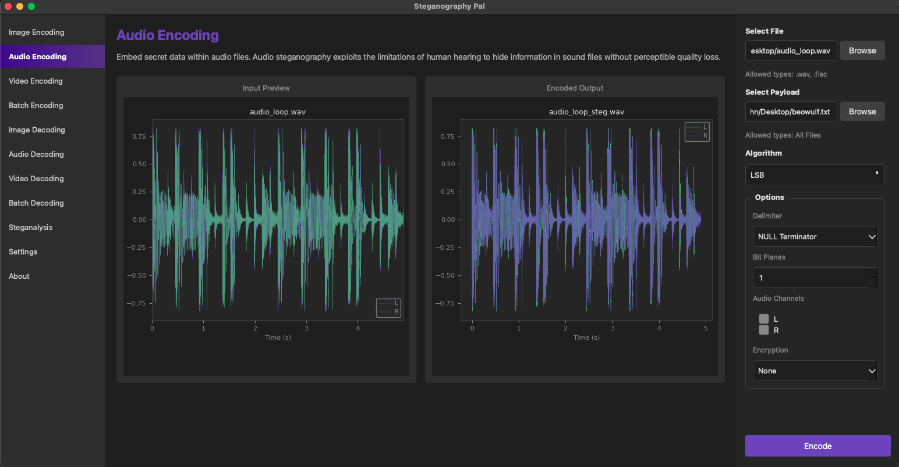
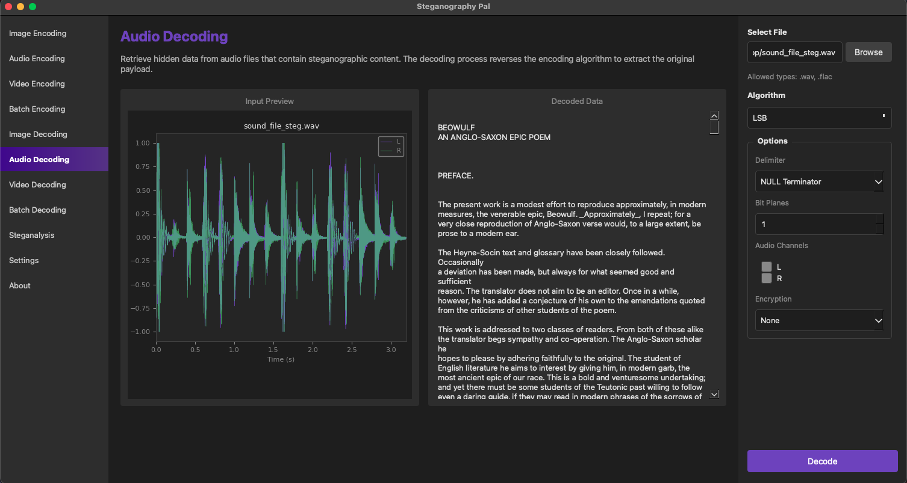
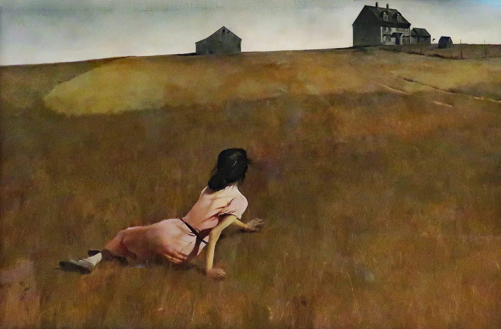

# Stega Pal

A modern steganography application built with Python and PySide6 for hiding and extracting data within image and audio files using the Least Significant Bit (LSB) technique.

## Contents

- [Introduction](#introduction)
- [Features](#features)
- [Getting Started](#getting-started)
  - [Prerequisites](#prerequisites)
  - [Installation](#installation)
  - [Running the Application](#running-the-application)
- [Usage](#usage)
  - [Image Encoding](#image-encoding)
  - [Image Decoding](#image-decoding)
  - [Audio Encoding](#audio-encoding)
  - [Audio Decoding](#audio-decoding)
- [Algorithm Details](#algorithm-details)
  - [LSB Steganography](#lsb-steganography)
  - [Image Encoding Options](#image-encoding-options)
  - [Audio Encoding Options](#audio-encoding-options)
- [Project Structure](#project-structure)
- [Future Development](#future-development)
- [Screenshots](#screenshots)

## Introduction

Stega Pal is a desktop GUI application designed to make steganography accessible and user-friendly. The application allows you to hide secret data within image and audio files in a way that's imperceptible to the human eye and ear, and later extract that data using the same parameters.

This is currently an MVP (Minimum Viable Product) with working image and audio encoding and decoding functionality using the LSB algorithm.

## Features

### Current Features (v0.2.0)

- **Image Encoding**: Hide text data within PNG, BMP, and TIFF image files
- **Image Decoding**: Extract hidden data from steganographic images
- **Audio Encoding**: Hide text data within WAV and FLAC audio files
- **Audio Decoding**: Extract hidden data from steganographic audio files
- **LSB Algorithm**: Industry-standard Least Significant Bit steganography with configurable bit planes (1-4)
- **Color Channel Selection**: Choose which RGB channels to use for image embedding (R, G, B, or any combination)
- **Audio Channel Selection**: Choose which audio channels to use for embedding (L, R, or both)
- **Waveform Preview**: Visual waveform display of input and encoded audio files
- **Encryption Support**: Optional AES encryption for payload data before embedding
- **Delimiter Options**:
  - NULL Terminator: Marks end of payload with null byte
  - Magic Sequence: Custom delimiter pattern
  - None: No delimiter (manual length tracking)
- **Payload Capacity Calculator**: Real-time calculation of maximum payload size based on carrier dimensions and settings
- **Live Preview**: Visual preview of input and output for both image and audio
- **Interactive Tooltips**: Hover over settings to see detailed explanations

## Getting Started

### Prerequisites

- Python 3.8 or higher
- pip (Python package manager)

### Installation

1. Clone the repository:
```bash
git clone https://github.com/yourusername/stega_pal.git
cd stega_pal
```

2. Create a virtual environment (recommended):
```bash
python -m venv venv
source venv/bin/activate  # On Windows: venv\Scripts\activate
```

3. Install dependencies:
```bash
pip install -r requirements.txt
```

### Running the Application

From the project root directory:

```bash
python src/main.py
```

Or from within the `src` directory:

```bash
cd src
python main.py
```

## Usage

### Image Encoding

1. **Select "Image Encoding"** from the left navigation menu
2. **Choose a carrier image**: Click "Select File" and choose a PNG, BMP, or TIFF image
3. **Choose your payload**: Click "Select Payload" and choose a text file to hide
4. **Configure settings**:
   - **Algorithm**: LSB (currently the only option)
   - **Delimiter**: Choose how to mark the end of your payload
   - **Bit Planes**: Select 1-4 bit planes (higher = more capacity but more visible)
   - **Color Channels**: Select which RGB channels to use for embedding
   - **Encryption**: Optionally enable AES encryption and enter a password
5. **Check capacity**: The calculator shows maximum payload size for your settings
6. **Click "Encode"**: The encoded image will be saved and displayed in the output preview

### Image Decoding

1. **Select "Image Decoding"** from the left navigation menu
2. **Choose the steganographic image**: Click "Select File" and choose the encoded image
3. **Configure settings** to match the encoding parameters:
   - Use the same delimiter, bit planes, color channels, and encryption settings
4. **Click "Decode"**: The hidden data will be extracted and displayed in the output panel

### Audio Encoding

1. **Select "Audio Encoding"** from the left navigation menu
2. **Choose a carrier audio file**: Click "Select File" and choose a WAV or FLAC file
3. **Choose your payload**: Click "Select Payload" and choose a text file to hide
4. **Configure settings**:
   - **Algorithm**: LSB (currently the only option)
   - **Delimiter**: Choose how to mark the end of your payload
   - **Bit Planes**: Select 1-4 bit planes (higher = more capacity, slightly more audible)
   - **Audio Channels**: Select which channels to embed in (L, R, or both)
   - **Encryption**: Optionally enable AES encryption and enter a password
5. **Click "Encode"**: The encoded audio file will be saved and its waveform displayed in the output preview

### Audio Decoding

1. **Select "Audio Decoding"** from the left navigation menu
2. **Choose the steganographic audio file**: Click "Select File" and choose the encoded WAV or FLAC file
3. **Configure settings** to match the encoding parameters:
   - Use the same delimiter, bit planes, audio channels, and encryption settings
4. **Click "Decode"**: The hidden data will be extracted and displayed in the output panel

**Important**: You must use the exact same settings that were used during encoding to successfully extract the data.

## Algorithm Details

### LSB Steganography

Least Significant Bit (LSB) steganography works by replacing the least significant bits of a carrier's data values with bits from your secret message. Since changing only the LSBs alters a value by ±1 at most, the modification is imperceptible to the human eye and ear.

**Image example**:
- Original pixel RGB: (157, 82, 200)
- Binary representation: (10011101, 01010010, 11001000)
- After embedding one bit in each channel: (10011100, 01010011, 11001001)
- New pixel RGB: (156, 83, 201) - virtually identical to the original

**Audio example**:
- Original sample (int16): 18245 = 0100011100000101
- After embedding one bit in LSB: 18244 = 0100011100000100
- Amplitude change of 1 out of 32768 — completely inaudible

### Image Encoding Options

#### Bit Planes (1-4)
Controls how many least significant bits per color channel are used for embedding:
- **1 bit plane**: Most secure, least capacity, virtually undetectable
- **2 bit planes**: 2x capacity, still very subtle
- **3 bit planes**: 3x capacity, may show slight color shifts
- **4 bit planes**: 4x capacity, more visible artifacts possible

#### Color Channels
Select which RGB channels to use:
- **R, G, B**: Maximum capacity (all channels)
- **R, G** or **R, B** or **G, B**: Medium capacity (two channels)
- **R** or **G** or **B**: Minimum capacity (one channel)

#### Delimiters
Marks where your payload ends:
- **NULL Terminator**: Appends a null byte (\0) to mark the end
- **Magic Sequence**: Uses a specific bit pattern (1111111100000000)
- **None**: No delimiter (you must track the payload length manually)

#### Encryption
- **None**: Payload embedded as-is
- **AES**: Payload encrypted with Fernet (AES-128 in CBC mode) before embedding
  - Requires a password for both encoding and decoding
  - Encrypted payload is base64-encoded to ensure safe character representation

### Audio Encoding Options

#### Bit Planes (1-4)
Controls how many least significant bits per audio sample are used for embedding:
- **1 bit plane**: Most secure, least capacity, completely inaudible
- **2 bit planes**: 2x capacity, still inaudible to most listeners
- **3 bit planes**: 3x capacity, extremely subtle on most audio
- **4 bit planes**: 4x capacity, may introduce faint noise on quiet passages

#### Audio Channels
Select which stereo channels to use:
- **L, R**: Maximum capacity (both channels)
- **L** or **R**: Half capacity (one channel only)

#### Capacity Reference
A 10-second stereo WAV at 44100 Hz holds approximately:
- 1 bit plane: ~107 KB
- 4 bit planes: ~430 KB

Delimiters and encryption options are the same as image encoding.

## Project Structure

```
stega_pal/
├── src/
│   ├── main.py                 # Application entry point
│   ├── core/
│   │   ├── algo_configs.py     # Algorithm configuration metadata
│   │   ├── settings.py         # Settings management
│   │   ├── encoders/
│   │   │   ├── __init__.py     # Encoder registry
│   │   │   ├── base.py         # Base encoder class
│   │   │   └── lsb.py          # LSB encoder implementation
│   │   ├── decoders/
│   │   │   ├── __init__.py     # Decoder registry
│   │   │   └── lsb.py          # LSB decoder implementation
│   │   └── crypto/
│   │       └── encrypt.py      # Encryption utilities
│   ├── gui/
│   │   ├── main_window.py      # Main application window
│   │   └── widgets/
│   │       ├── file_picker.py  # File selection widget
│   │       ├── encoding_panel.py # Dynamic settings panel
│   │       └── widget_factory.py # Widget creation factory
│   └── utils/
│       └── validators.py       # Input validation
├── requirements.txt            # Python dependencies
└── README.md
```

## Future Development

The following features are planned for future releases:

- **Video Steganography**: Embed data across video frames in AVI and MKV files
- **Batch Operations**: Encode/decode across multiple files simultaneously
- **Additional Algorithms**: DCT, DWT, and other steganography techniques
- **Steganalysis Tools**: Detect potential steganographic content in files
- **Advanced Encryption**: Additional cipher options beyond AES

## Screenshots

Example of Image Encoding workflow:


Example of Image Decoding Workflow:


Audio LSB Encoding Workflow with waveform comparison:


Audio decoding with waveform and extracted text:


Original Image:


Image containing Shakespeare's Macbeth in it's entirety:



---

**Version**: 0.2.0 MVP
**License**: TBD
**Author**: John H
